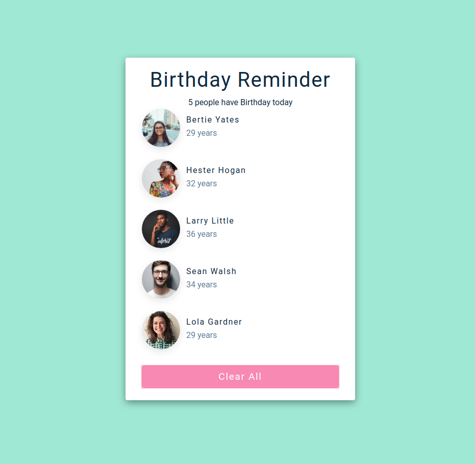
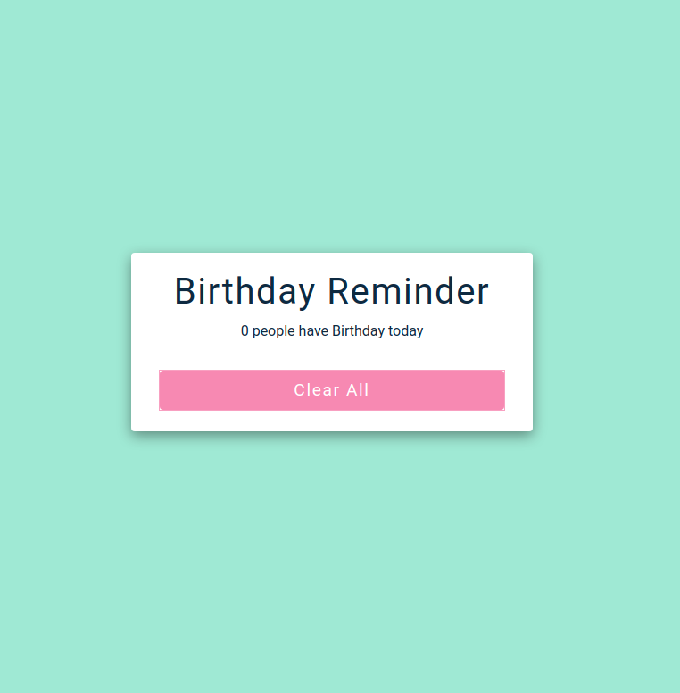

## 15 days with React 
<br/> 

### Project 01
<br/> 

# Birthday Reminder

### Fetches People information and shows some info on a card
### The button can clear the list when clicked
<hr />


<table>
  <tr>
    <td>Birthday People List</td>
     <td>List Cleared</td>
  </tr>
  <tr>
    <td></td>
    <td> </td>
  </tr>
 </table>
<hr /><br/> <br/>

* ### Fetches people information from another file and show then in a card
 * ### Includes a button to clear the list

```
useState
````
<hr />

## Demo

## <a class href="https://remind-birthday.netlify.app" target="_blank" >See Live</a>


<!--
<p float="center">
  
   
</p>

Birthday List              |  List cleared
:-------------------------:|:-------------------------:
  |  
-->
