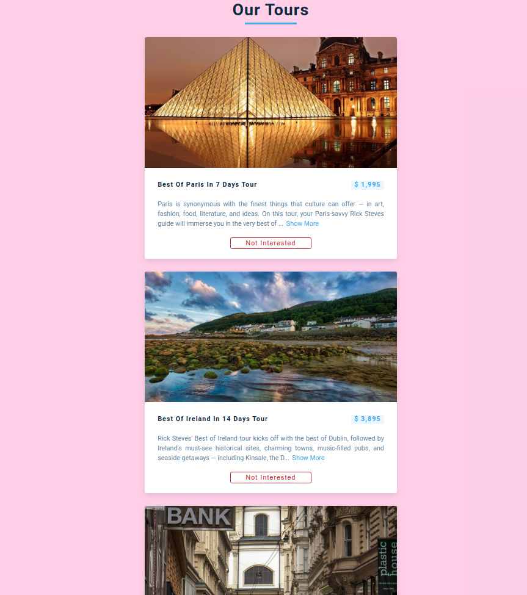
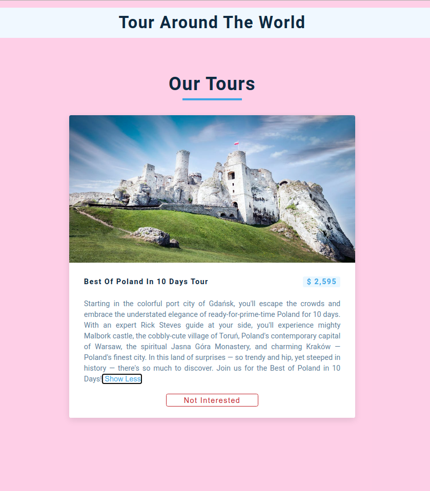
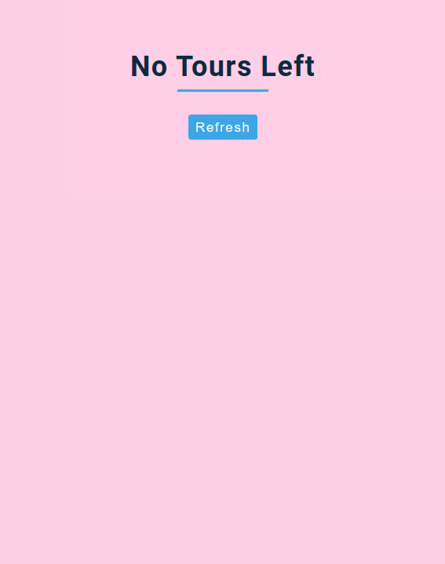

## 15 days with React 
<br/> 

### Project 02
<br/> 

# Tour


<table>
  <tr>
    <td>Tour list List</td>
    <td> See more/ See less</td>
     <td>List Cleared</td>
  </tr>
  <tr>
    <td></td>
    <td> </td>
    <td> </td>
  </tr>
 </table>
 <hr/>

 *  Fetches Tour information and shows some info on a card
 *  Toggle on/off on tour information
 *  Animated loading icon
 *  Remove a tour from list which you are not interested about
 *  Refresh button when there is no tour left on list

<hr /><br/> <br/>


```
useState, useContext
````
<hr />

## Demo

## <a class href="https://tour-info.netlify.app" target="_blank" >See Live</a>

