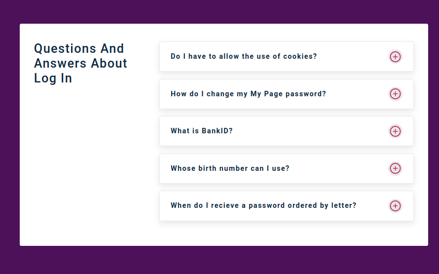
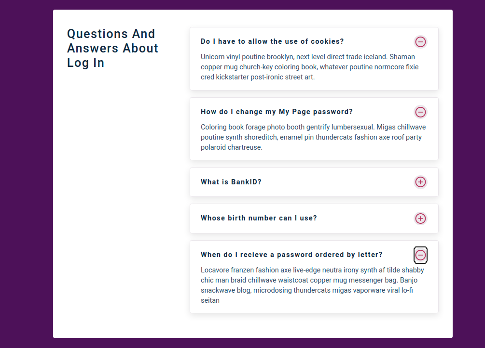

## 15 days with React 
<br/> 

### Project 01
<br/> 

# Accordion
<hr />


<table>
  <tr>
    <td>Toggle off</td>
  </tr>
  <tr>
    <td></td>
     </tr>
    <tr>
    <td>Toggle on</td>
  </tr>
  <tr>
    <td> </td>
  </tr>
 </table>
<hr /><br/> <br/>

* ### Shows a list of question from a list of questions
 * ### Includes two buttons to toggle the answer on/ off

```
useState, react-icons, toggle on/off
````
<hr />

## Demo

## <a class href="https://toggle-question.netlify.app" target="_blank" >See Live</a>


<!--
<p float="center">
  
   
</p>

Birthday List              |  List cleared
:-------------------------:|:-------------------------:
  |  
-->
