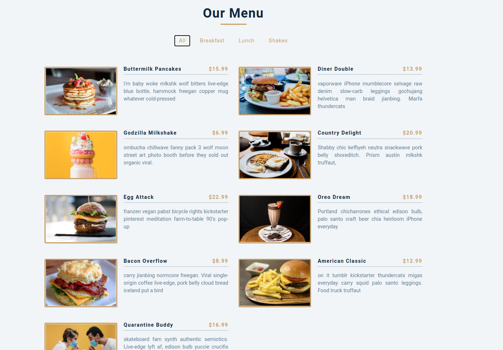
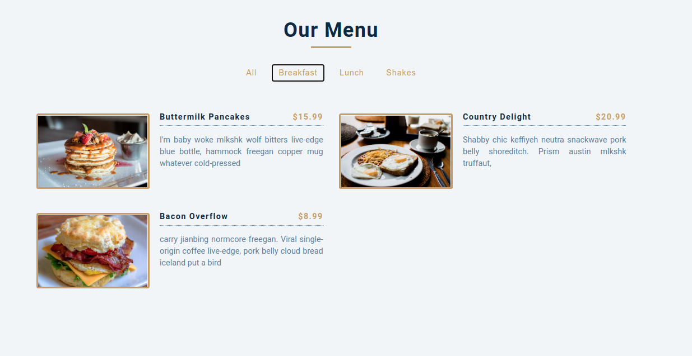
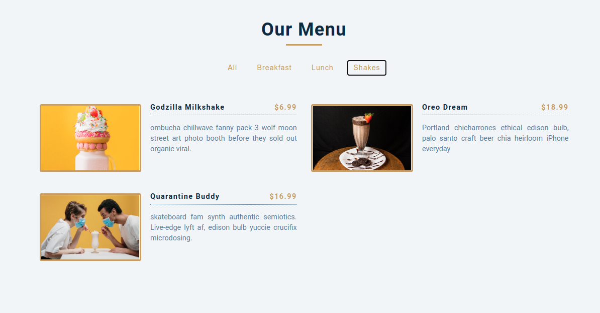

## 15 days with React 
<br/> 

### Project 05
<br/> 

# Food menu
<hr />


<table>
  <tr>
    <td>Filter all</td>
  </tr>
  <tr>
    <td></td>
     </tr>
    <tr>
    <td>Filter only breakfasts</td>
  </tr>
  <tr>
    <td> </td>
  </tr>
  <td>Filter only shakes</td>
  </tr>
  <tr>
    <td> </td>
  </tr>
 </table>
<hr /><br/> <br/>

*  Shows a list of foods
*  Includes buttons to filter foods based on catagory

```
useState, Set
````
<hr />

## Demo

## <a class href="item-menu.netlify.app" target="_blank" >See Live</a>


