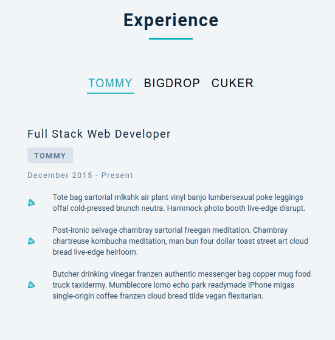
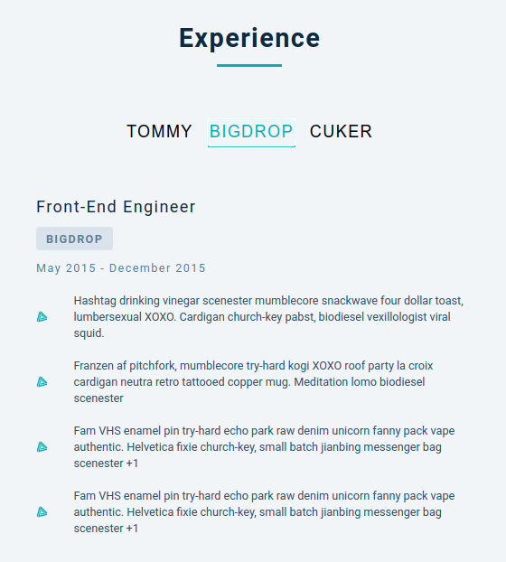
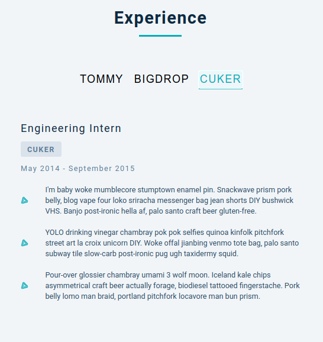

## 15 days with React 
<br/> 

### Project 06
<br/> 

# Resume Tabs
<hr />


<table>
  <tr>
    <td></td>
  </tr>
  <tr>
    <td></td>
     </tr>
    <tr>
    <td></td>
  </tr>
  <tr>
    <td> </td>
  </tr>
  <td></td>
  </tr>
  <tr>
    <td> </td>
  </tr>
 </table>
<hr /><br/> <br/>

*  Shows Job experience information from API
*  Different button will show different role experience
* Role buttons will be generated dynamically based on experience info

```
useState, Set
````
<hr />

## Demo

## <a class href="https://item-menu.netlify.app/" target="_blank" >See Live</a>


