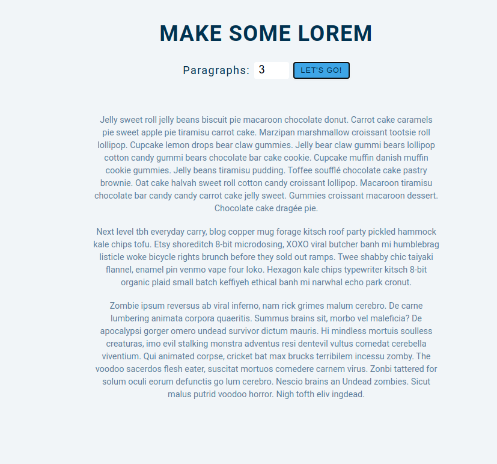

## 15 days with React 
<br/> 

### Project 08
<br/> 

# Lorem Ipsum Generator
<hr />


<table>
  <tr>
    <td></td>
  </tr>
  <tr>
    <td></td>
     </tr>
 </table>
<hr /><br/> <br/>

*  Generate paragraph with random text 
*  Give how many paragraphs you want, get now
* If your input is 0 or less, you will get 1 paragraph.
```
useState
````
<hr />

## Demo

## <a class href="https://makelorem.netlify.app" target="_blank" >See Live</a>


